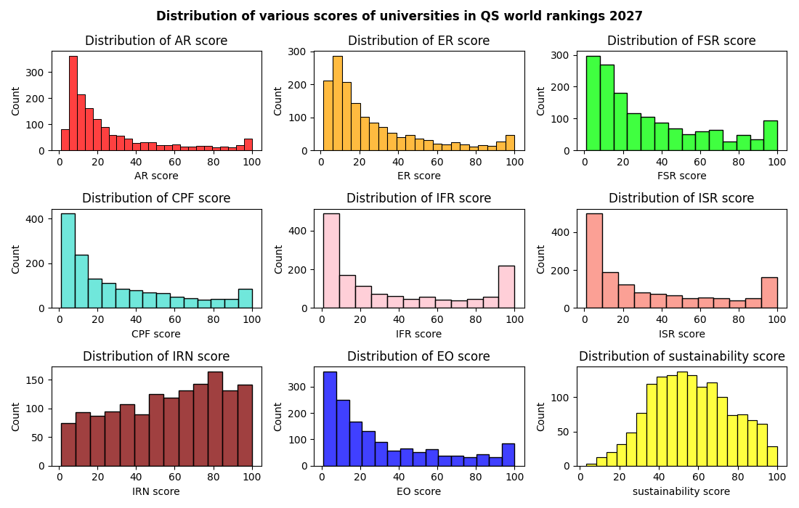
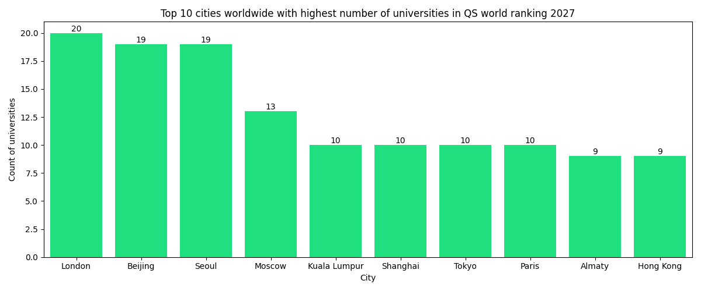
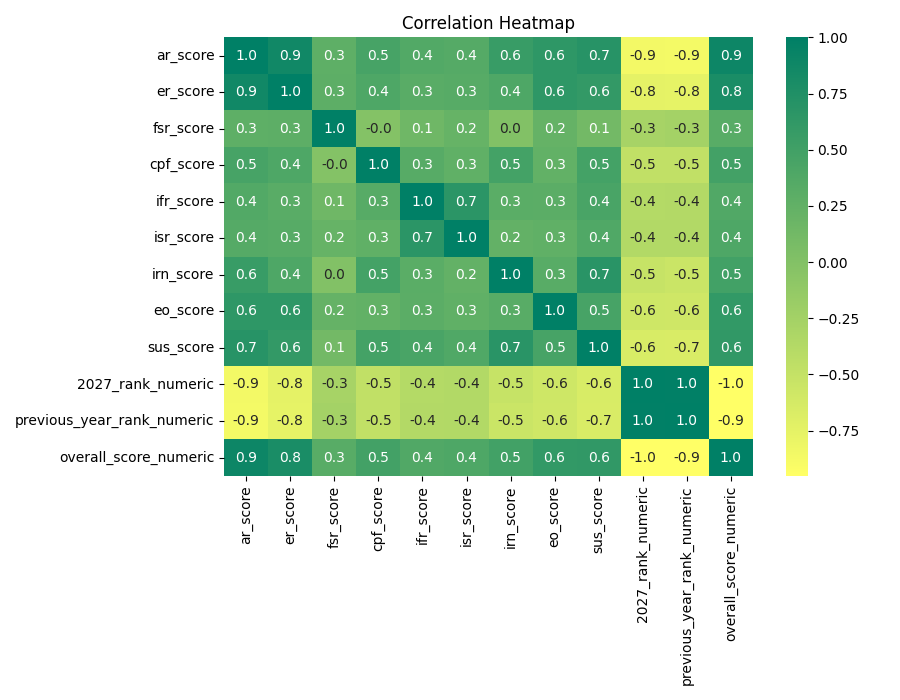
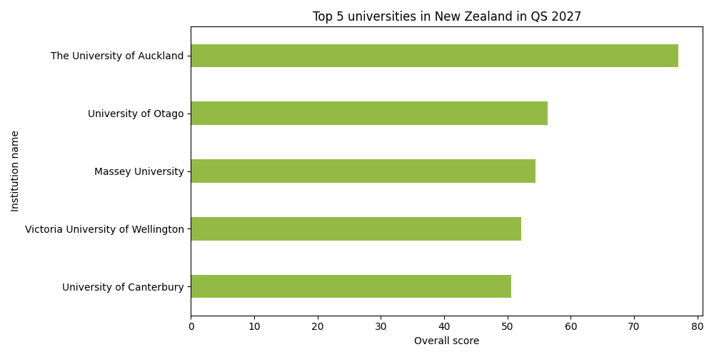
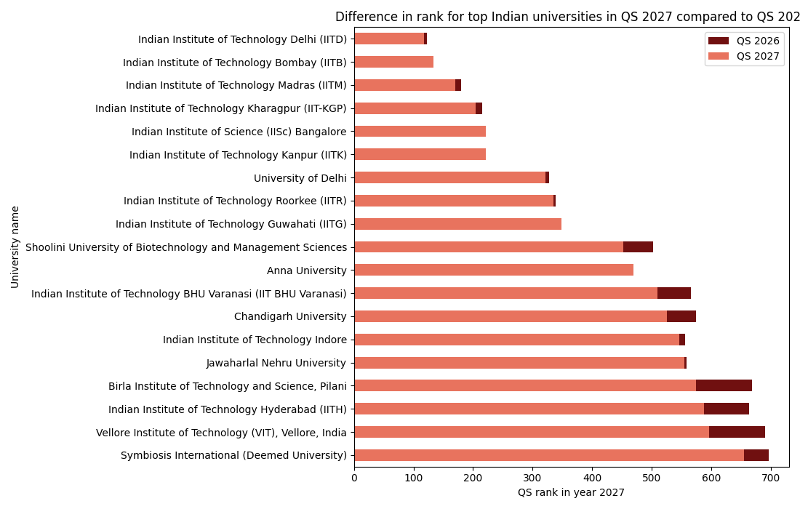

# Data Analysis of QS World University Rankings 2027

  
  
  
  
  
  

### Dataset
Source: <a href="https://www.qs.com/">QS world</a>

Dataset url: https://www.kaggle.com/datasets/reshmaharidhas/2027-qs-world-university-rankings

Size: 1504 rows

### Kaggle Notebook
Notebook url: https://www.kaggle.com/code/reshmaharidhas/qs-world-university-ranking-2027-eda/notebook

### Analysis Workflow💻
- Exploratory Data Analysis (EDA)
- Data cleaning
- Data Visualizations
- Key Insights

### Tech stack💻
- Pandas
- Matplotlib
- Seaborn
- Python
- Numpy
- Plotly

### Visualizations💻

### License💻
MIT
